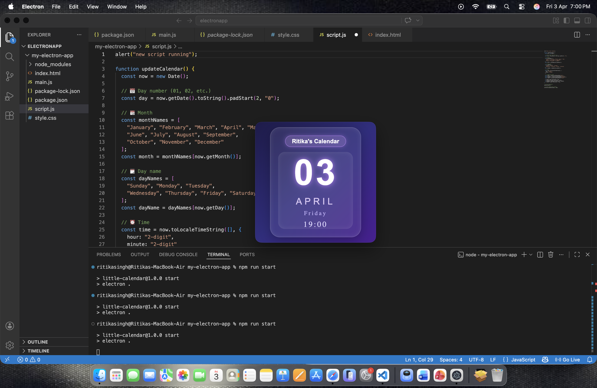

# 📅 Electron Calendar Widget

A minimal and aesthetic **desktop calendar + clock widget** built using Electron.js.

---

## ✨ Features

* 📆 Displays current date (day & month)
* 🗓️ Shows weekday (Monday, Tuesday, etc.)
* ⏰ Live updating clock
* 🎨 Glassmorphism UI design
* 🖱️ Draggable widget
* 📏 Resizable window

---

## 🛠️ Tech Stack

* Electron.js
* HTML
* CSS
* JavaScript

---

## 🚀 Getting Started

### 1️⃣ Clone the repository

```bash
git clone https://github.com/ritsyweb/Calendar-widget.git
cd Calendar-widget
```

---

### 2️⃣ Install dependencies

```bash
npm install
```

---

### 3️⃣ Run the application

```bash
npm start
```

---

## 📸 Preview



> 📌 Add a screenshot of your app named `preview.png` in the root folder

---

## 📂 Project Structure

```
├── index.html
├── style.css
├── script.js
├── main.js
├── package.json
├── package-lock.json
```

---

## 💡 Learnings

This project helped me understand:

* Electron window management
* Real-time DOM updates
* UI/UX design for desktop widgets
* Debugging rendering and scaling issues

---

## 🔮 Future Improvements

* 🌙 Dark / Light mode
* 🎞️ Animations and transitions
* 📌 Always-on-top widget
* 🌦️ Weather integration

---

## 🙌 Acknowledgements

Inspired by modern desktop widgets and aesthetic UI designs.

---

## 📬 Connect with me

Feel free to connect or share feedback!

---

⭐ If you like this project, consider giving it a star!
